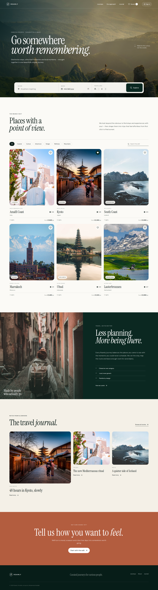
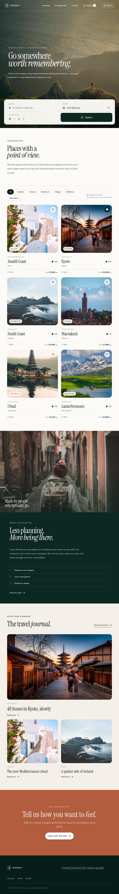
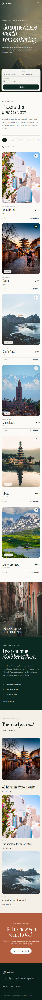

# Roamly — Travel Booking Experience



A premium editorial travel-discovery and booking product built with React, Vite, Supabase and PostgreSQL.

## Visual direction

Roamly deliberately avoids the generic OTA/dashboard look. The direction is **editorial travel magazine × conversion-focused booking product**: immersive photography, expressive serif display type, a quiet forest/cream palette, compact discovery controls and generous whitespace.

Reference research was completed before implementation across current Dribbble and Behance travel-booking work plus premium web patterns. The implementation is original rather than a clone. Patterns studied included image-first discovery, low-friction search, curated choice architecture, transparent pricing, trust cues and mobile-first booking flows.

## Feature set

- Immersive responsive hero with destination, date and traveller search
- Curated journey catalog with category filters and live text search
- Saved-journey mode with optimistic interaction feedback
- Journey detail modal with pricing and experience highlights
- Booking drawer with date, traveller controls, notes and transparent totals
- Sign-in/sign-up/account drawer wired for Supabase Auth
- Live catalog loading/error/empty states with local portfolio fallback
- Supabase-backed saved journeys when authenticated
- Secure server-side booking RPC with database-calculated pricing
- Booking history/account experience
- Editorial brand/story section and travel journal
- Mobile navigation and purpose-built desktop/tablet/mobile layouts
- Keyboard-visible focus states, semantic dialogs and accessible control labels
- Automated Playwright overflow and interaction QA at desktop, tablet and mobile widths
- Automated 30+ second working-project showcase export after the quality gate passes

## Responsive evidence

| Desktop | Tablet | Mobile |
| --- | --- | --- |
|  |  |  |

## Stack

React 18 · Vite · Supabase Auth · PostgreSQL · Row Level Security · Playwright · Lucide React · CSS design system

## Local setup

```bash
npm install
cp .env.example .env
npm run dev
```

Add the dedicated project's Supabase URL and **publishable key** to `.env`. Never place a service-role/secret key in browser code or GitHub.

```env
VITE_SUPABASE_URL=...
VITE_SUPABASE_PUBLISHABLE_KEY=...
```

Production and QA checks:

```bash
npm run build
npm run test:e2e
npm run preview
```

## Backend architecture

The application has its own Supabase project rather than sharing tables with another portfolio app.

`supabase/migrations/001_initial_schema.sql` defines `profiles`, `journeys`, `saved_journeys` and `bookings`. RLS is enabled on every exposed application table. Public visitors can only read active journeys; profiles, saved journeys and bookings are restricted to their authenticated owner.

`supabase/migrations/002_seed_and_secure_booking.sql` seeds the curated catalog and adds `create_booking(...)`. The RPC reads the authoritative journey price in PostgreSQL, validates the future departure date and traveller count, calculates subtotal and service fee server-side, and inserts the booking for `auth.uid()` so the browser cannot forge pricing.

`supabase/migrations/003_harden_profile_trigger.sql` removes API execution privileges from the security-definer profile trigger. The dedicated backend was checked with Supabase's security advisor after migration and returned no security lints.

### Data model

- `profiles` — user-owned account/profile information
- `journeys` — public active travel inventory
- `saved_journeys` — authenticated user's favorites
- `bookings` — authenticated user's booking records
- `create_booking(...)` — validated server-side booking/pricing RPC

## Security model

- Publishable key only in the React client
- RLS enabled across all exposed application tables
- Owner checks use `auth.uid()`
- Booking totals are calculated in PostgreSQL rather than trusted from the UI
- Security-definer auth trigger is not callable through the public API
- No service-role key is committed

## Quality gate

GitHub Actions builds the production bundle, launches the real Vite app, checks desktop/tablet/mobile interactions and horizontal overflow, captures evidence, records the actual walkthrough, verifies it is at least 30 seconds, and exports the MP4 showcase. The repository includes the verified responsive screenshots above.
